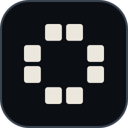

<p align="center">
  
</p>

<h1 align="center">rill</h1>

<p align="center">
  <b>A web framework in Go that sends HTML first.</b><br>
  <i>Compile the whole page. Execute the smallest part of it.</i>
</p>

<p align="center">
  <a href="https://github.com/apptivitypl/rill/actions/workflows/ci.yml"></a>
  <a href="https://pkg.go.dev/github.com/apptivitypl/rill"></a>
  <a href="https://github.com/apptivitypl/rill/blob/main/go.mod"></a>
  
  <a href="#licence"></a>
  
</p>

rill compiles `.rill` templates into a flat render plan and, in production, executes the smallest
part of it that answers the request: a prebuilt artifact before a render, a fragment before a page,
a page before a whole document. The same project builds two ways — a Cloudflare Worker with static
assets, and a single static binary — and CI builds the reference application both ways and
fails if the two return different documents.

JavaScript ships only for the components you mark. The client runtime is about 2 KB after brotli,
and a project with no interactive component ships none of it. The bundler and the Tailwind
compiler are native binaries, so no Node process runs at build time and none at run time; a
template that uses React still needs npm, pnpm, yarn or bun once, to fetch React itself.

It is in development. Nothing is released yet, the config format has changed once already, and it
will change again before 1.0.

## Try it online

The starter is committed at [examples/hello-world](examples/hello-world), and there is a
[blog](examples/blog) beside it. All three buttons open the same folder.

<p align="center">
  <a href="https://stackblitz.com/github/apptivitypl/rill/tree/main/examples/hello-world"></a>
  <a href="https://codesandbox.io/p/devbox/github/apptivitypl/rill/tree/main/examples/hello-world"></a>
  <a href="https://codespaces.new/apptivitypl/rill?quickstart=1"></a>
</p>

One folder, three ways in, because the three differ in what they can run. CodeSandbox and
Codespaces boot a machine that has Go on it and start `rill dev`, so editing a `.rill` file rebuilds
and reloads; the first boot compiles the framework and takes a minute or two. Their setup lives in
the example's `.devcontainer` and `.codesandbox`.

StackBlitz has no Go toolchain and never will, so `.stackblitzrc` sends it somewhere else: it starts
the published `@apptivitypl/rill-demo-hello-world` instead of building. That package is `rill build --target
demo` output — the same worker module the Cloudflare build produces, compiled to WebAssembly and
served by node — so it is not a screenshot. Pages, loaders and api routes are answered by the Go code
in this folder. It just cannot recompile a template, because that needs `go build`.

## Install

On Linux and macOS:

```bash
curl -fsSL https://raw.githubusercontent.com/apptivitypl/rill/main/install.sh | sh
```

On Windows, in PowerShell:

```powershell
irm https://raw.githubusercontent.com/apptivitypl/rill/main/install.ps1 | iex
```

Both work out which build this machine wants, check the archive against the `checksums.txt`
published beside it, and check the signature on that file too when `cosign` is installed. A
signature that fails to verify stops the install; one that is absent only stops it when you ask for
`--require-signature`, which also refuses to run without `cosign`. Running either again is how you
update: it stops when what you have is already what the release holds. Both take `--version`,
`--dir` (an absolute path), `--force` and `--require-signature`.

If piping a script into a shell is not something you do, read
[install.sh](install.sh) first, or skip it — every release publishes an archive for Linux, macOS
and Windows on both amd64 and arm64 on the
[releases page](https://github.com/apptivitypl/rill/releases/latest). Unpack one and put `rill` on your
PATH.

From source, if you have Go:

```bash
go install github.com/apptivitypl/rill/cmd/rill@latest
```

The same binaries are on npm, which is the shortest route on a machine that already has node:

```bash
pnpm add -D @apptivitypl/rill
```

```bash
pnpm create rill my-site
```

`@apptivitypl/rill` is a launcher plus one package per platform, pulled in as optional dependencies, so
nothing compiles and no install script runs. `pnpm dlx @apptivitypl/rill new my-site` is the same thing
without adding a dependency. None of it removes the need for Go: rill writes Go and then calls
`go build`.

To remove it again, with `--purge` to take the Tailwind download cache with it:

```bash
curl -fsSL https://raw.githubusercontent.com/apptivitypl/rill/main/uninstall.sh | sh
```

## Quick start

```bash
rill new my-site --module example.com/my-site
```

```bash
cd my-site && rill dev
```

`rill new` writes the project, runs `go mod tidy`, and installs the browser packages if the
template needs them. Without `--yes` it asks for the module path, template, languages, navigation
mode, css engine and theme. Its output for two of the templates is committed under
[examples/](examples), so you can read what it writes without running it.

Three templates ship. `hello-world` is one page with a live component, a fetched list and a JSON
route; `blog` is markdown posts with a feed; `catalog` carries the wider surface — filters,
differential navigation, a form without javascript, server-sent events, and both a cached and a
deferred fragment.

## Project layout

`rill new` writes this. The three directories at the bottom are written by the compiler and are in
the generated `.gitignore`; everything above them is yours.

```
my-site/
  app/                 routes: page.rill, layout.rill, api/*/route.go
  components/          components, one file each
  server/              hand-written Go the loaders call
  styles/              source stylesheet
  public/              copied to the CDN as-is
  locales/             message catalogs, one json file per language
  cmd/server/          entry point for the binary target
  cmd/worker/          entry point for the worker target
  rill.jsonc           configuration

  internal/gen/        generated Go, embedded assets, the render plan
  dist/                what you deploy
  .rill/               intermediates, never deployed
```

Generated Go lives under `internal/` rather than in a directory of its own, because the go tool
skips anything beginning with a dot and `go:embed` cannot reach outside its own package. That
constraint is the whole reason for the shape.

## How it works

A build has three steps that are worth knowing about.

**Compile.** Every `.rill` file is parsed against a real grammar, not a regular expression. Types
declared in a template's Go block become the props of the component, and a mismatch is a build
error with a code — `RILL-C318` and the other 37 have a page under [docs/errors](docs/errors).

**Lower.** The result is a flat instruction plan, not a tree walked at request time. Static runs of
markup collapse into single byte ranges, so rendering a page is mostly copying.

**Execute.** At request time the server walks only the part of the plan the request needs. A page
whose loader has not changed comes out of the bounded response cache; a page that differs from the
one the browser already has can answer with just the fragment that changed.

## Configuration

`rill.jsonc` — JSON with comments and trailing commas, the same dialect as `wrangler.jsonc`.

```jsonc
{
  "$schema": "https://raw.githubusercontent.com/apptivitypl/rill/main/schema/rill.schema.json",
  "app": {"name": "my-site"},
  "i18n": {
    "mode": "path",
    "defaultLocale": "en",
    "locales": ["en", "pl"]
  },
  // a sheet smaller than this goes into the document, anything larger is
  // served as its own cached file; "0" links every stylesheet. Every file
  // under styles/ is a sheet, and the inlined ones are written before the
  // linked ones so a full sheet still overrides a small critical one
  "css": {"engine": "tailwind", "inlineLimit": "4kb"},
  "nav": {"mode": "partial"},
  // the largest body a submission or an api route will read, the origins
  // allowed to write across sites, and a ceiling on concurrent connections
  // for the native server; omit maxConnections for no limit
  "security": {"maxBodySize": "8mb", "trustedOrigins": [], "maxConnections": 0}
}
```

Unknown keys are an error, not a shrug — a misspelled setting names itself and the line it is on.
The [schema](schema/rill.schema.json) drives editor completion, and CI fails if it and the Go
struct ever disagree.

## Deploying

Two targets from one project.

```bash
rill build --target workers && wrangler deploy
```

```bash
rill build --target native && ./dist/server
```

The worker build writes `wrangler.jsonc` beside the project and puts the assets where Static Assets
expects them. The native build produces one binary with everything embedded; it needs no files
beside it.

There is a third target, for showing the project rather than deploying it:

```bash
rill build --target demo && node dist/demo/server.mjs
```

It compiles the same worker to WebAssembly, but against the browser runtime, so the module needs no
`workerd`, no wrangler and no bindings — `dist/demo` is a folder that answers requests wherever node
runs, and the same `worker.mjs` runs in a browser tab. That is what makes the project openable in an
online editor that has no Go toolchain. Templates are not recompiled there, because that step does
need Go.

## Tooling

`rill dev` watches the project, rebuilds what changed and reloads the browser. It answers on
localhost only; `rill dev -host` puts it on every interface when you want to open it from a phone.
`rill routes` prints
what the compiler found. `rill check` compiles without writing anything. `rill lsp` speaks the
language server protocol on stdin and stdout, so an editor can show the same diagnostics the build
would.

## What is not there yet

- No release yet, so the install scripts and the npm packages have nothing to fetch. Build from
  source until there is one.
- Windows is built and tested, but ten tests that rely on a read-only directory skip there,
  because Windows lets the owner write into one anyway.
- The committed examples require a published rill, so until the first release they only build
  against a workspace, which `go run ./cmd/rilltool example --workspace` writes.
- Streaming a page in more than one flush is limited to the deferred-fragment modes.

## Contributing

Read [CONTRIBUTING.md](CONTRIBUTING.md) first — it lists the rules CI actually enforces, and
`go run ./cmd/rilltool ci` runs every one of them locally before you push.

[ARCHITECTURE.md](ARCHITECTURE.md) explains how a request becomes bytes, and which package owns
which part of that.

## Security

Report a vulnerability privately through
[a security advisory](https://github.com/apptivitypl/rill/security/advisories/new), never a public
issue. [SECURITY.md](SECURITY.md) describes what counts as a vulnerability in a framework like this
one.

## Licence

Dual-licensed under [MIT](LICENSE-MIT) or [Apache 2.0](LICENSE-APACHE), at your option.

The starter ships JetBrains Mono under the SIL Open Font License; its licence travels with the font
in the generated project.
