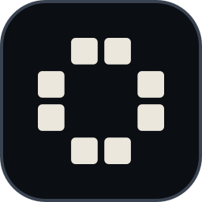

<p align="center">
  
</p>

<h1 align="center">GoPage</h1>

<p align="center">
  <b>A web framework in Go that sends HTML first.</b><br>
  <i>Compile the whole page. Execute the smallest part of it.</i>
</p>

<p align="center">
  <a href="https://github.com/apptivitypl/gopage/actions/workflows/ci.yml"></a>
  <a href="https://pkg.go.dev/github.com/apptivitypl/gopage"></a>
  <a href="https://github.com/apptivitypl/gopage/blob/main/go.mod"></a>
  
  <a href="#licence"></a>
  
</p>

GoPage compiles `.gopage` templates into a flat render plan and, in production, executes the smallest
part of it that answers the request: a prebuilt artifact before a render, a fragment before a page,
a page before a whole document. The same project builds two ways: a Cloudflare Worker with static
assets, and a single static binary. CI builds the reference application both ways and fails if the
two return different documents.

JavaScript ships only for the components you mark. The client runtime is about 2 KB after brotli,
and a project with no interactive component ships none of it. The bundler and the Tailwind
compiler are native binaries, so no Node process runs at build time and none at run time; a
template that uses React still needs npm, pnpm, yarn or bun once, to fetch React itself.

> [!WARNING]
> **The API is not stable.** Templates, configuration and the Go API can change between releases,
> sometimes in ways that need edits in your project. Pin a version, and read the release notes
> before you raise it.

## Try it online

No install, no account, no clone. Both starters are committed under [examples/](examples), and every
button opens one.

<p align="center">
  <a href="https://codesandbox.io/p/devbox/github/apptivitypl/gopage/tree/main/examples/hello-world"></a>
  <a href="https://codespaces.new/apptivitypl/gopage?quickstart=1"></a>
</p>

Both boot a machine and leave `gopage dev` running, so editing a template rebuilds it and reloads the
page. The first boot takes a minute or two.

## Install

On Linux and macOS:

```bash
curl -fsSL https://raw.githubusercontent.com/apptivitypl/gopage/main/install.sh | sh
```

On Windows, in PowerShell:

```powershell
irm https://raw.githubusercontent.com/apptivitypl/gopage/main/install.ps1 | iex
```

Both work out which build this machine wants, check the archive against the `checksums.txt`
published beside it, and check the signature on that file too when `cosign` is installed. A
signature that fails to verify stops the install; one that is absent only stops it when you ask for
`--require-signature`, which also refuses to run without `cosign`. Running either again is how you
update: it stops when what you have is already what the release holds. Both take `--version`,
`--dir` (an absolute path), `--force` and `--require-signature`.

If piping a script into a shell is not something you do, read
[install.sh](install.sh) first, or skip it. Every release publishes an archive for Linux, macOS
and Windows on both amd64 and arm64 on the
[releases page](https://github.com/apptivitypl/gopage/releases/latest). Unpack one and put `gopage` on your
PATH.

A build from the tip of `main` is published every night under the `nightly` tag, signed the same way a
release is:

```bash
curl -fsSL https://raw.githubusercontent.com/apptivitypl/gopage/main/install.sh | sh -s -- --version nightly
```

That tag moves with every build and carries no compatibility promise. It is not published to npm, so
`@apptivitypl/gopage` always resolves to a real release.

From source, if you have Go:

```bash
go install github.com/apptivitypl/gopage/cmd/gopage@latest
```

The same binaries are on npm, which is the shortest route on a machine that already has node:

```bash
pnpm dlx @apptivitypl/gopage new my-site
```

```bash
pnpm dlx @apptivitypl/gopage dev
```

The first scaffolds a project, the second runs it, neither installs anything. A project that
already has a `package.json` can pin the version for everyone with `pnpm add -D @apptivitypl/gopage`.

Nothing compiles and no install script runs: the binary for your platform arrives as an optional
dependency.

gopage writes Go and then calls `go build`, so a build needs a Go toolchain. It uses the one on your
PATH. When there is none it says so and fetches a pinned Go once into the same cache Tailwind uses,
checking it against a published sha256 before unpacking it; `GOPAGE_GO` points at a toolchain you would
rather it used. The cache is `~/.cache/gopage` on Linux, `~/Library/Caches/gopage` on macOS and
`%LocalAppData%\gopage` on Windows.

To remove it again, with `--purge` to take the Tailwind download cache with it:

```bash
curl -fsSL https://raw.githubusercontent.com/apptivitypl/gopage/main/uninstall.sh | sh
```

## Quick start

```bash
gopage new my-site --module example.com/my-site
```

```bash
cd my-site && gopage dev
```

`gopage new` writes the project, runs `go mod tidy`, and installs the browser packages if the
template needs them. Without `--yes` it asks for the module path, template, languages, navigation
mode, css engine and theme.

Three templates ship. [`hello-world`](examples/hello-world) is one page with a live component, a
fetched list and a JSON route; [`blog`](examples/blog) is markdown posts with a feed;
[`catalog`](examples/catalog) carries the wider surface: filters, differential navigation, a form
without javascript, server-sent events, and both a cached and a deferred fragment. All three are
committed under [examples/](examples), so you can read what `gopage new` writes without running it.

## Project layout

`gopage new` writes this. The three directories at the bottom are written by the compiler and are in
the generated `.gitignore`; everything above them is yours.

```
my-site/
  app/                 routes: page.gopage, layout.gopage, api/*/route.go
  components/          components, one file each
  server/              hand-written Go the loaders call
  styles/              source stylesheet
  public/              copied to the CDN as-is
  locales/             message catalogs, one json file per language
  cmd/server/          entry point for the binary target
  cmd/worker/          entry point for the worker target
  gopage.jsonc           configuration

  internal/gen/        generated Go, embedded assets, the render plan
  dist/                what you deploy
  .gopage/               intermediates, never deployed
```

Generated Go lives under `internal/` rather than in a directory of its own, because the go tool
skips anything beginning with a dot and `go:embed` cannot reach outside its own package. That
constraint is the whole reason for the shape.

A `layout.gopage` wraps every page below it, and a nested one wraps the pages below that. A layout
that opens with `` starts the chain at itself, so nothing above it wraps those
pages: that is how a login screen, a print view or an embed gets a document of its own. A directory
in brackets groups routes without appearing in the address, so `app/(auth)/login/page.gopage`
answers `/login`.

A layout can load its own data. It declares `Props` and `Load` like a page and reads the result
under `layout.`, so navigation, a language switcher or a breadcrumb is written once instead of
being repeated in the props of every page below it.

## How it works

A build has three steps that are worth knowing about.

**Compile.** Every `.gopage` file is parsed against a real grammar, not a regular expression. Types
declared in a template's Go block become the props of the component, as do types it imports from the
project's own packages, and a mismatch is a build error with a code. Every code has a page under
[docs/errors](docs/errors).

**Lower.** The result is a flat instruction plan, not a tree walked at request time. Static runs of
markup collapse into single byte ranges, so rendering a page is mostly copying.

**Execute.** At request time the server walks only the part of the plan the request needs. A page
whose loader has not changed comes out of the bounded response cache; a page that differs from the
one the browser already has can answer with just the fragment that changed.

## Configuration

`gopage.jsonc` is JSON with comments and trailing commas, the same dialect as `wrangler.jsonc`. What
`gopage new` writes is about this long; every key not named has a default.

```jsonc
{
  "$schema": "https://raw.githubusercontent.com/apptivitypl/gopage/main/schema/gopage.schema.json",
  "app": { "name": "my-site" },
  "i18n": { "mode": "path", "defaultLocale": "en", "locales": ["en", "pl"], "prefixDefault": false },
  "routing": { "reserved": ["/api", "/_gopage", "/robots.txt", "/sitemap.xml", "/favicon.ico"] },
  "css": { "engine": "tailwind", "inlineLimit": "4kb" },
  "nav": { "mode": "partial" },
  "fragments": { "deferred": "fetch" },
}
```

The keys that decide something worth knowing about:

| key                       |                                                                                                                                                                                                                                      |
| ------------------------- | ------------------------------------------------------------------------------------------------------------------------------------------------------------------------------------------------------------------------------------ |
| `i18n.mode`               | `path` puts every locale but the default behind a prefix, `subdomain` maps hosts to languages, `single` turns the whole thing off                                                                                                    |
| `css.inlineLimit`         | a stylesheet under this size is written into the document, a larger one is served as its own cached file; `0` links every sheet. Inlined sheets are written before linked ones, so a full sheet still overrides a small critical one |
| `nav.mode`                | `partial` sends only the part of the document that changed                                                                                                                                                                           |
| `security.maxConnections` | a ceiling for the native server; omit it for none. The worker target is bounded by the platform instead                                                                                                                              |
| `security.privateCookies` | names the cookies that make a response personal. A request carrying one is never cached                                                                                                                                              |
| `routing.aliases`         | the segment each locale uses in public addresses, so one route answers `/docs`, `/pl/dokumenty` and `/de/handbuch`                                                                                                                    |
| `redirects[].host`        | limits a redirect to one host, so old subdomains and `www` are consolidated in the configuration rather than at the edge. The port is ignored, `www.` is not, and a host named here answers without repeating it under `hosts`        |
| `seo`                     | the built-in `/sitemap.xml` and `/robots.txt`: crawler rules, extra sitemaps, and `mode: "off"` on either when a route of yours answers the path                                                                                      |
| `images`                  | `mode: "on"` serves `/_gopage/image` and points `<Image>` at it, resizing and re-encoding on the way out                                                                                                                              |
| `cache.variants`          | how many entries one route may hold once its `` directives are multiplied out; a route over the ceiling is a build warning                                                                                                  |

Unknown keys are an error, not a shrug: a misspelled setting names itself and the line it is on.
The [schema](schema/gopage.schema.json) drives editor completion, and CI fails if it and the Go
struct ever disagree.

## Sitemap, images and sessions

What a public site needs is built in. Each of these is a setting or a hook, not a library to wire
up.

**Sitemap and robots.** `/sitemap.xml` and `/robots.txt` are served without configuration. Routes
without parameters are listed once per locale, with reciprocal `hreflang` and `x-default`. A route
with parameters lists itself:

```go
func Sitemap(ctx *gopage.Ctx) (gopage.SitemapSeq, error) {
	return gopage.SitemapOf([]gopage.SitemapEntry{{Path: "/jobs/warszawa", LastMod: updated}}), nil
}
```

For a route without parameters the sitemap asks its `Meta`: a `Canonical` becomes the address it
lists, and `noindex` in `Robots` keeps the page out. To answer either path yourself, set
`seo.sitemap.mode` or `seo.robots.mode` to `"off"`; claiming the path while the generator is on is
`GOPAGE-C112` at build time rather than a panic at startup.

**Images.** With `images.mode: "on"`, `<Image>` points at `/_gopage/image` and emits a `srcset` from
the widths you configure, so a phone downloads a phone-sized file. The endpoint decodes, scales and
re-encodes with the standard library, caches the result as immutable, and reads remote sources only
from `images.hosts`. The decoders are linked only into a project whose config asks for them, so a
site that serves no optimised images does not carry them; WebP and AVIF are yours to add through
`images.Support`.

**Sessions.** A loader can read and write the response:

```go
if held, ok := ctx.Cookie("session"); ok {
	user = verify(held.Value)
}
ctx.Header().Set("X-Robots-Tag", "noindex, follow")
ctx.Status(http.StatusGone)
```

A request carrying a cookie named in `security.privateCookies` is never cached, and neither is a
response that sets a cookie. A request without one is still shared, so the same page stays fast for
readers who are not signed in.

**Localised addresses.** `routing.aliases` gives one route a different segment per locale. The
canonical form redirects to the public one, so a page has a single address, and `canonical` and
`hreflang` follow without a second table to maintain. `routing.normalize` folds trailing slashes,
case and diacritics onto one spelling. A locale prefix is found whatever case it arrives in and
redirected once to the spelling `i18n.locales` declares, so `/PL/about` lands on `/pl/about` rather
than on nothing. Assets, `public/` files and reserved paths are never normalised, and a redirect
keeps the query it was given.

**Middleware.** `Options.Middleware` runs just before the router, after redirects, rewrites and the
locale prefix have been settled, so it sees the path a route matches and answers `gopage.LocaleOf`.
`Options.Entry` runs before all of that and sees the address exactly as it arrived, which is where a
rule the configuration cannot express belongs — a host consolidation, say. Refusing an unknown host,
the security headers, cross-origin protection and the body limit still come first, and neither the
locale nor `Locals` is in the context yet. A middleware that wants the address as it arrived without
giving up the rest of the chain reads `gopage.AskedPath(r)` and `gopage.AskedPrefix(r)`; the second
answers the prefix the visitor spelled and nothing at all when there was none, which is what tells
`/` and `/en` apart.

**Partial navigation.** With `nav.mode: "partial"` a click sends only the part of the document that
changed, and the answer goes through the same page cache as the document — the tail of the layout
chain is its own entry, keyed by how much the two pages share rather than by where the visitor came
from. A partial is never advertised to shared caches: a route with a TTL answers `private, max-age`,
everything else `private, no-cache`. Links that change only the query stay in partial navigation, so
pagination, sorting and filters do not reload the page. The scroll goes to the top when the path
changes and stays put when only the query does; `data-gopage-scroll` on a link overrides that with
`top`, `keep` or `smooth`, and `data-gopage-nav="off"` opts a link out altogether.

**Chrome data.** A layout declares `Props` and `Load` of its own and reads them under `layout.`:

```gopage
---
type Props struct {
	Sections []Section
}

func Load(ctx *gopage.Ctx) (Props, error) { return Props{Sections: nav.For(ctx.Locale())}, nil }
---
<nav>
  <a href="{{ link.Href }}">{{ link.Title }}</a>
</nav>

```

Bare names in a layout still read the props of the page inside it. The layout's freshness folds into
the page's, taking the shorter lifetime and the union of the tags, and the loader is skipped
entirely when the browser already holds that layout and asks for a partial navigation.

**One round of loading.** The loaders in a chain do not know about each other, so they run at the
same time: two layouts and a page that each wait 50 ms on an API answer in a little over 50 ms, not
150. A page whose only loader is its own runs it in place, without a goroutine. `Meta` is handed
what `Load` returned rather than loading again, so a route fetches its data once per request.

Work that two of them share is asked for once:

```go
cities, err := gopage.Once(ctx, "cities:"+ctx.Locale(), catalog.Cities)
```

The second caller waits for the first and gets the same answer. The scope is one request, so there
is no lifetime to set and nothing to invalidate. For fanning out inside a single loader, use
`errgroup` as you would anywhere else in Go.

**Cache variants.** A page that differs by a preference stays shared, one entry per value:

```gopage

```

The values are the whole list, so the number of entries is known at build time and a value nobody
declared falls into a single bucket shared by all of them. `ctx.Cookie` then hands the loader that
bucket rather than the raw cookie, which is why the response can stay shared without one visitor's
page reaching another. A dimension in a layout applies to every page below it. For a cookie that
says who someone is, use `security.privateCookies` instead: naming the same cookie in both is
`GOPAGE-C330`.

**Testing.** `app.Render(ctx, route, params)` returns the bytes of a route and
`app.RenderFragment(ctx, route, fragment, params)` the bytes of one deferred fragment, without an
HTTP round trip. `gopage.TestApp` builds an application that holds nothing in its cache, so a loader
runs on every call.

**Dates and messages.** `time.Time` is a props type. `{{ Posted | date('date') }}` formats it, and
`{{ Posted | relative }}` reads `time.days_ago` and its siblings from your catalogs, so a missing
translation is a build error rather than English on a Polish page. Messages take named arguments:
`t("jobs.in_city", city = City)`, checked against the placeholders in every catalog.

## Deploying

Two targets from one project.

```bash
gopage build --target workers && wrangler deploy
```

```bash
gopage build --target native && ./dist/server
```

The worker build writes `wrangler.jsonc` beside the project and puts the assets where Static Assets
expects them. The native build produces one binary with everything embedded; it needs no files
beside it.

A third target exists for showing a project rather than deploying it:

```bash
gopage build --target demo && node dist/demo/server.mjs
```

`dist/demo` is a self-contained folder that serves the site anywhere node runs, with no wrangler, no
`workerd`, no bindings and no Go. It is a reasonable way to hand someone a preview without deploying
anything.

## Tooling

`gopage dev` watches the project, rebuilds what changed and reloads the browser. It answers on
localhost only; `gopage dev -host` puts it on every interface when you want to open it from a phone.
`gopage routes` prints what the compiler found, with the address each locale publishes when the
project renames segments. `gopage check` compiles without writing anything. `gopage css install`
fetches the Tailwind binary this project pins, which the build does on its own when it is missing.
`gopage lsp` speaks the language server protocol on stdin and stdout, so an editor can show the same
diagnostics the build would, and `gopage version` prints the version the binary was built from.

## What is not there yet

- Windows is built and tested on every change, but a handful of tests skip there because they rely
  on Unix file semantics, so it gets less coverage than Linux and macOS.
- Streaming a page in more than one flush is limited to the deferred-fragment modes.

## Contributing

Read [CONTRIBUTING.md](CONTRIBUTING.md) first. It lists the rules CI actually enforces, and
`go run ./cmd/gopagetool ci` runs every one of them locally before you push.

[ARCHITECTURE.md](ARCHITECTURE.md) explains how a request becomes bytes, and which package owns
which part of that.

## Security

Report a vulnerability privately through
[a security advisory](https://github.com/apptivitypl/gopage/security/advisories/new), never a public
issue. [SECURITY.md](SECURITY.md) describes what counts as a vulnerability in a framework like this
one.

## Licence

Dual-licensed under [MIT](LICENSE-MIT) or [Apache 2.0](LICENSE-APACHE), at your option.

The starter ships JetBrains Mono under the SIL Open Font License; its licence travels with the font
in the generated project. The `og` package draws its card with the Go font, which is BSD licensed,
so that licence travels with a binary that imports it. Nothing else reaches the font, and a project
that never imports `og` does not link it at all.
